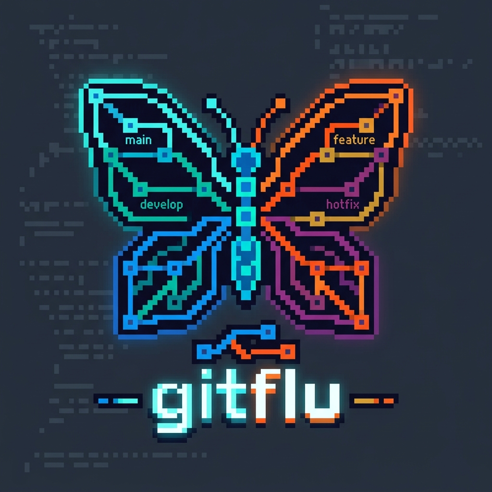
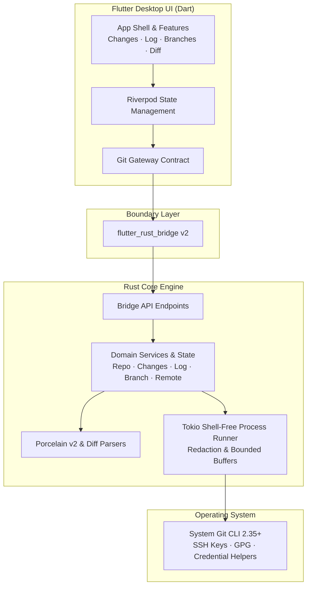

<div align="center">



# gitflu

**`gitflow` + `flutter` + `git gui`**

*A blazing fast, keyboard-first, clean-room Git GUI built with Flutter Desktop & high-performance Rust.*

[](LICENSE)
[](https://flutter.dev)
[](https://www.rust-lang.org)
[](https://github.com)
[](https://github.com)

---

</div>

## 💡 About gitflu

**gitflu** is a standalone, lightweight, cross-platform Git GUI client designed for developers who love the smooth, keyboard-centric Git workflow of modern IDEs (such as JetBrains Git tool window and GitFlow branching) without the weight and memory footprint of opening a full IDE.

Built with a **Flutter Desktop** frontend for crisp, responsive UI and a **Rust** backend engine for secure, shell-free Git execution, **gitflu** gives you instant visibility into your changes, seamless branch management, and zero-latency diff navigation.

---

## ✨ Key Features

- ⚡ **Blazing Fast & Ultra Lightweight**: Rust-powered background engine coupled with Flutter Desktop provides smooth 60/120 FPS UI responsiveness and minimal memory usage.
- 🦋 **Intuitive GitFlow & Branch Graph**: Visual commit topology graph, lane-based branch history, and frictionless branch creation/checkout.
- ⌨️ **Keyboard-First Ergonomics**: Instant keyboard shortcuts for staging, committing, diff jumping, log browsing, and branch switching.
- 🔒 **Native & Secure Git Integration**: Directly leverages your system Git CLI (`2.35+`). Uses your existing SSH keys, GPG configuration, and credential helpers without storing credentials or exposing tokens in diagnostics.
- 🛡️ **Shell-Free Process Safety**: Direct argument-vector process execution in Rust (`tokio::process`), preventing command injection and shell escape vulnerabilities.
- 🎨 **Modern Material 3 Design**: Clean pixel & dark/light theme aesthetics with unified diff highlighting, hunk navigation, and responsive layouts.
- 🧪 **Clean-Room Verification**: Designed and verified independently from first principles using clean-room behavioral test harnesses.

---

## 🏗️ Architecture



---

## 🚀 Getting Started

### Prerequisites

- **System Git**: `2.35+` installed and available in `PATH`
- **Flutter**: `3.24+` (Desktop enabled: `flutter config --enable-windows-desktop` / `--enable-macos-desktop` / `--enable-linux-desktop`)
- **Rust**: `1.80+` (stable toolchain)
- **flutter_rust_bridge_codegen**: `2.13.0` (`cargo install flutter_rust_bridge_codegen --version 2.13.0`)

### Building from Source

1. **Clone the repository:**
   ```bash
   git clone https://github.com/your-org/gitflu.git
   cd gitflu
   ```

2. **Install Flutter dependencies:**
   ```bash
   flutter pub get
   ```

3. **Verify Rust & Dart test suites:**
   ```bash
   # Run Rust tests
   cargo test --manifest-path native/Cargo.toml

   # Run Flutter unit & widget tests
   flutter test
   ```

4. **Run the desktop app:**
   ```bash
   # On Windows
   flutter run -d windows

   # On macOS
   flutter run -d macos

   # On Linux
   flutter run -d linux
   ```

---

## 🧭 MVP Roadmap

- [x] **Core Bridge & Scaffold**: Cargokit + `flutter_rust_bridge` desktop integration.
- [x] **Behavior Contract Harness**: Clean-room Git behavior testing with environment isolation.
- [ ] **Git Engine & Safety**: Shell-free process runner, URL credential redaction, and Git 2.35+ discovery.
- [ ] **Repository State & Changes**: Staged/Unstaged/Untracked file groups, single/multi-file staging, safe discard.
- [ ] **Unified Diff Viewer**: Lazy syntax-highlighted diffs, hunk boundaries, binary file detection.
- [ ] **Commit Workflow**: Commit message editor, author preservation, and instant tree refresh.
- [ ] **Branch & GitFlow Manager**: Local/remote branch list, search, checkout, and fast branch creation.
- [ ] **Visual Log & Graph**: Paginated log (200 commits/page), topology lane renderer, commit details.
- [ ] **Remote Operations**: `fetch`, fast-forward `pull --ff-only`, safe `push`, background operation bar & cancel.

---

## 🤝 Contributing

Contributions, feature requests, and bug reports are warmly welcome!

1. Fork the Project
2. Create your Feature Branch (`git checkout -b feature/amazing-feature`)
3. Follow the commit convention: `type(scope): subject` (e.g., `feat(diff): add syntax highlighting`)
4. Verify tests before opening a PR (`cargo test` & `flutter test`)
5. Open a Pull Request

---

## 📄 License

Distributed under the **MIT License**. See `LICENSE` for more information.
