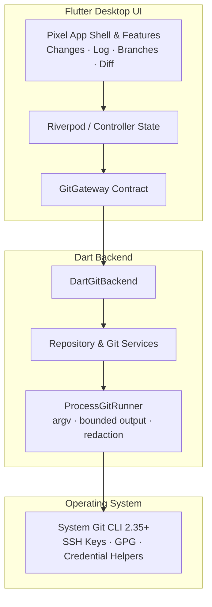

<div align="center">


# gitflu

**`gitflow` + `flutter` + `git gui`**

*A keyboard-first, clean-room behavioral reverse engineering of a JetBrains-style Git GUI, presented as a minimal 2D pixel-game interface.*

[](LICENSE)
[](https://flutter.dev)
[](https://dart.dev)
[](https://github.com)

</div>

## About gitflu

gitflu is a lightweight, cross-platform Git GUI whose product target is the
user-visible workflow and information hierarchy of the Git GUI system in
JetBrains IDEs. The project uses black-box behavioral reverse engineering: it
reproduces observable states and feedback with original code and assets,
without copying proprietary implementation details.

The UI is intentionally minimal and game-like: a restrained dark palette,
crisp pixel borders, compact panels, and small original 2D pixel motifs. It
keeps desktop Git density and keyboard-first behavior while making the next
safe action obvious to a new user. Flutter owns presentation; a pure Dart
backend runs the system Git executable directly and exposes typed domain
services to the UI.

The backend uses `Process.start` with an argument list and
`runInShell: false`. Git commands never cross a shell, credentials are
redacted from diagnostics, and captured output is bounded.

처음 코드를 읽는다면 [코드 흐름 안내](docs/ARCHITECTURE.md)에서 화면부터
백엔드와 system Git까지 이어지는 호출 순서를 먼저 확인하세요.

## Architecture



## Features

- Flutter Desktop frontend with Material 3.
- JetBrains Git GUI behavior ledger with a clean-room, black-box reverse-engineering target.
- Minimal 2D pixel-game visual system with keyboard-first desktop interactions.
- Dart-only backend with no FFI, native bridge, or generated bindings.
- System Git discovery and validation for Git 2.35+.
- Opaque, session-local repository handles.
- Recent repository persistence and configurable Git executable path.
- Shell-free process execution with bounded output and credential-safe errors.

## Getting started

### Prerequisites

- System Git `2.35+` available in `PATH`.
- Flutter stable with Windows, macOS, or Linux desktop enabled.
- Dart SDK `3.13+` (provided by the matching Flutter SDK).

### Build and verify

```bash
git clone https://github.com/your-org/gitflu.git
cd gitflu
flutter pub get
flutter analyze
flutter test
```

Run the desktop app with `flutter run -d windows`, `flutter run -d macos`, or
`flutter run -d linux`.

## Roadmap

- [x] Dart backend scaffold, safe Git executor, Git discovery, and repository opening.
- [ ] JetBrains-equivalent behavior slices with the original pixel UI system.
- [ ] Repository status and grouped changes view.
- [ ] Bounded unified diff viewer.
- [ ] Staging, discard, and commit workflows.
- [ ] Branch graph, branch management, and remote operations.
- [ ] Packaging and multi-OS CI.

## Contributing

Follow the commit convention `type(scope): subject`, keep Git execution
argument-based, and run `flutter analyze` plus `flutter test` before opening a
pull request.

## License

Distributed under the MIT License. See [LICENSE](LICENSE) for more
information.
