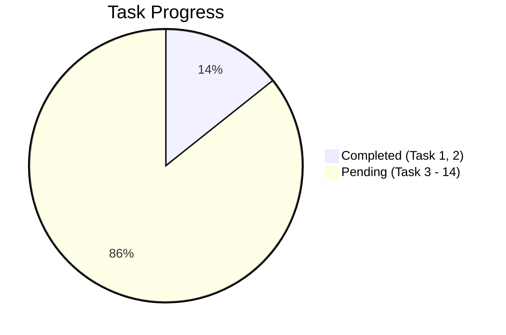

# 📋 gitflu (Branchline MVP) Task Management

> **Project Goal:** Build a clean-room, cross-platform Git GUI (`gitflu`) with Flutter Desktop UI and Rust system-Git core for Windows, macOS, and Linux.

---

## 📊 Progress Overview

- **Total Tasks:** 14
- **Completed:** 2 / 14 (14.3%)
- **Current Active Task:** `Task 3: Safe Git Executor, Discovery & Redaction`

---

## 🗂️ Task Status Summary Table

| # | Task Scope | Rust Core Deliverables | Flutter Desktop Deliverables | Status |
|---|---|---|---|:---:|
| **1** | Scaffold & Bridge | `native/`, `api::health()`, FRB v2 codegen | `BranchlineApp` shell, `app_boot_test.dart` | ✅ Completed |
| **2** | Behavior Ledger & Test Harness | `TestRepo`, `bare_remote`, safe sandbox | Clean-room scenario ledger (`STATUS-01` ~ `REMOTE-01`) | ✅ Completed |
| **3** | Git Executor & Discovery | `ProcessGitRunner`, `GitError`, redaction, PATH scan | FRB settings bridge (`get_git_installation`) | ⏳ Pending |
| **4** | Repository Registry & Open | `AppState`, opaque `RepositoryId`, root validation | `WelcomeScreen`, `RecentRepositoryStore`, Git settings dialog | ⏳ Pending |
| **5** | Status Parser & Changes | Porcelain v2 `-z` stream parser, snapshot hashing | `ChangesScreen`, grouped changes list (`Conflicts/Staged/...`) | ⏳ Pending |
| **6** | Unified Diff Viewer | Bounded 5MB/20K line diff stream, rename detection | Monospace `UnifiedDiffView`, lazy hunk builder | ⏳ Pending |
| **7** | Staging & Mutation | Serialized `git add`/`restore --staged` via NUL stdin | Checkbox selection, Stage/Unstage action buttons | ⏳ Pending |
| **8** | Discard Changes | 60s expiring token, preview validation, `git restore` | Safe `DiscardDialog`, irreversible warning banner | ⏳ Pending |
| **9** | Commit Panel | `git commit -F -` UTF-8 message stdin, hook mapping | `CommitPanel`, `Ctrl/Cmd+K` focus, `Ctrl/Cmd+Enter` | ⏳ Pending |
| **10** | Paginated History & Graph | `git log --topo-order`, deterministic lane calculator | `LogScreen`, paginated graph renderer, commit details | ⏳ Pending |
| **11** | Branch Management | `for-each-ref`, `check-ref-format`, switch tracking | `BranchPopup`, search/filter, tracking confirmation | ⏳ Pending |
| **12** | Remotes & Cancellation | Tokio process groups / JobObject, `OperationRegistry` | `OperationBar`, Fetch/Pull/Push controls, Upstream dialog | ⏳ Pending |
| **13** | Desktop UX & Theme | Redacted diagnostic formatting, error classification | 3-column responsive shell, Light/Dark tokens, Shortcuts | ⏳ Pending |
| **14** | Packaging & Multi-OS CI | Cross-platform verify script, release workflows | Windows ZIP, macOS ad-hoc DMG, Linux AppImage/deb | ⏳ Pending |

---

## 📝 Detailed Task Breakdown

### ✅ Task 1: Scaffold Flutter, Rust, and Desktop Bridge
- [x] Configure toolchain versions (`tool/versions.json`): Flutter 3.47.2, Dart 3.13.2, Rust 1.92.0, FRB 2.13.0
- [x] Scaffold Flutter desktop runner & native Rust library (`native/Cargo.toml`)
- [x] Bridge health contract API (`Health { product, core_version }`)
- [x] Implement minimal `BranchlineApp` Material 3 shell
- [x] Setup Cargokit desktop embedding

### ✅ Task 2: Behavior Contract & Test Harness
- [x] Document neutral clean-room scenarios (`docs/research/jetbrains-git-mvp-behavior.md`)
- [x] Isolated `TestRepo` test fixture with local `user.name`/`user.email` overrides
- [x] GPG signing bypass and relative path directory traversal safeguards
- [x] Bare remote repository initialization helper (`TestRepo::bare_remote()`)

### ⏳ Task 3: Safe Git Executor, Discovery & Redaction
- [ ] Implement `GitErrorCategory` taxonomy and credential-safe redaction (`native/src/error.rs`)
- [ ] Shell-free `GitInvocation` with `Capture` (bounded 16MB) and `Stream` policies (`native/src/executor/`)
- [ ] Git executable discovery & minimum version check (Git >= 2.35)
- [ ] Expose `get_git_installation()` and `configure_git_path(path)` settings APIs
- [ ] Rust integration tests with spaces and shell metacharacters (`native/tests/git_executor.rs`)

### ⏳ Task 4: Repository Handles & Welcome Screen
- [ ] Random UUID `RepositoryId` and in-memory `AppState` registry
- [ ] Shell-free root validation via `rev-parse --show-toplevel`
- [ ] Abstract `GitGateway` Flutter boundary & `FrbGitGateway` adapter
- [ ] `WelcomeScreen` with recent repository list (max 10, persisted via SharedPreferences)
- [ ] Git executable settings modal with path selection & retry flow

### ⏳ Task 5: Porcelain v2 Status & Changes View
- [ ] Zero-copy/lossy NUL-delimited `git status --porcelain=v2 -z --branch` parser
- [ ] Independent tracking of staged, unstaged, untracked, and conflicted facets
- [ ] Snapshot content hashing and generation increments
- [ ] Riverpod `ChangesController` with timer/mutation-based polling
- [ ] Grouped `ChangesScreen` (Conflicts, Staged, Unstaged, Untracked)

### ⏳ Task 6: Bounded Unified Diff Viewer
- [ ] Rust diff parser with 5 MiB / 20,000 lines truncation limits
- [ ] Support added, deleted, context, rename headers, and binary file warnings
- [ ] Flutter `UnifiedDiffView` with lazy `ListView.builder` hunk rendering
- [ ] Stale generation and rapid-selection cancellation handling

### ⏳ Task 7: Serialized Staging & Unstaging
- [ ] Mutex-protected repository mutation lock
- [ ] NUL-delimited path pipe to `git add --pathspec-from-file=- --pathspec-file-nul`
- [ ] Unstaging via `git restore --staged --pathspec-from-file=- --pathspec-file-nul`
- [ ] Multi-selection Stage/Unstage UI buttons and keyboard triggers

### ⏳ Task 8: Tracked Change Discard & Confirmation
- [ ] 60-second expiring preview token with SHA-256 digest validation
- [ ] Revalidation of generation and working-tree state before destructive restore
- [ ] `git restore --worktree` execution (never using `git clean` or raw file removal)
- [ ] Interactive `DiscardDialog` showing preserved vs discarded state

### ⏳ Task 9: Commit Staged Changes & Message State
- [ ] UTF-8 multiline commit message piping via `git commit -F -`
- [ ] Empty message validation and pre-commit hook failure categorization
- [ ] Flutter `CommitPanel` with `Ctrl/Cmd+K` focus and `Ctrl/Cmd+Enter` submit
- [ ] Draft message preservation across failures and automatic reset upon commit success

### ⏳ Task 10: Paginated History & Graph Lanes
- [ ] Paginated `git log --topo-order` with NUL delimiter parsing
- [ ] Deterministic branch lane allocation algorithm (`graph_lanes.rs`)
- [ ] Historical diff viewing between commit parents and root tree
- [ ] Lazy 200-item page loader in Flutter `LogScreen`

### ⏳ Task 11: Branch Management & Checkout
- [ ] `git for-each-ref` parsing for local and remote-tracking refs
- [ ] Branch ref name format validation via `git check-ref-format --branch`
- [ ] Clean working-tree validation before branch switch
- [ ] `BranchPopup` with search, filter, local checkout, and tracking creation

### ⏳ Task 12: Remote Operations & Process Cancellation
- [ ] Opaque `RemoteId` and URL credential masking
- [ ] Fetch, fast-forward-only pull (`git pull --ff-only`), and push flows
- [ ] Windows Job Object / Unix process group termination for instant cancellation
- [ ] Real-time operation progress bar and active task cancellation UI

### ⏳ Task 13: Responsive Workspace Shell, Theme & Shortcuts
- [ ] 3-column responsive layout (Changes, Diff, Commit) adapting to narrow widths
- [ ] Light and Dark Material 3 theme styling
- [ ] Global keyboard shortcuts (`Ctrl/Cmd+R` refresh, `Ctrl/Cmd+K` commit, `Esc` cancel)
- [ ] Redacted diagnostic drawer with clipboard copy feature

### ⏳ Task 14: Packaging, Multi-OS CI & Smoke Tests
- [ ] End-to-end integration smoke test with real Rust bridge
- [ ] Cross-platform verification scripts (`tool/verify.ps1`, `tool/verify.sh`)
- [ ] GitHub Actions CI workflow for Windows, macOS, and Linux
- [ ] Release packaging: Windows portable ZIP, macOS ad-hoc DMG, Linux AppImage/DEB

---

## 🛡️ Project Development Rules (`AGENTS.md`)

1. **Commit per query session**: Follow Conventional Commits format `type(scope): subject`.
2. **Changelog maintenance**: Upsert past-tense entries into `CHANGELOG.md` upon any feature, bug fix, or breaking change.
3. **No proprietary assets**: Clean-room development only (no proprietary icons, fonts, or code).
4. **Shell-free execution**: Always execute Git commands through discrete argv arrays, never shell strings.
